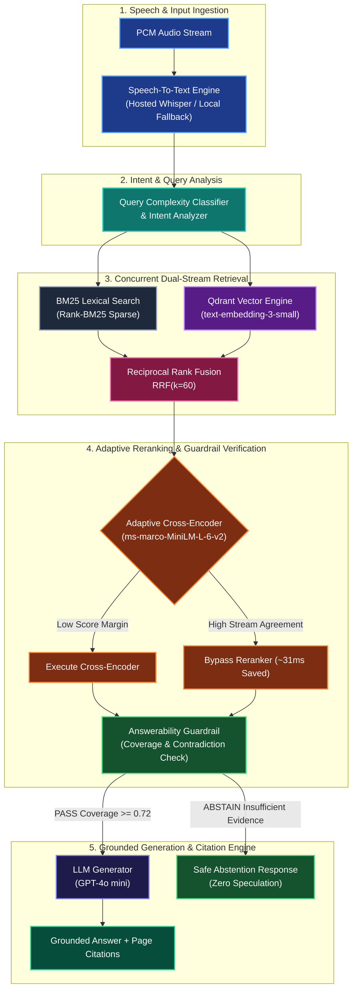

<div align="center">

# VoiceRAG

**Production-Oriented, Voice-Enabled Retrieval-Augmented Generation System**  
*From Streaming Voice → Dual-Stream Hybrid Retrieval → Adaptive Reranking → Guardrail Verification → Grounded Answer with Citations.*

<br/>

[](https://github.com/sanjanb/voice-rag)
[](https://python.org)
[](https://nextjs.org)
[](https://qdrant.tech)
[](https://github.com/astral-sh/ruff)
[](LICENSE)

</div>

VoiceRAG is an enterprise-grade, low-latency Voice Retrieval-Augmented Generation (RAG) system. It combines real-time streaming Speech-to-Text (STT), dual-stream hybrid retrieval (Dense Vector Search + BM25 Lexical Index), Reciprocal Rank Fusion (RRF), adaptive cross-encoder reranking, and formal answerability guardrails to deliver provably grounded responses with zero hallucination.

---

## Table of Contents

- [Key Capabilities](#key-capabilities)
- [System Architecture](#system-architecture)
- [Technology Stack](#technology-stack)
- [Benchmark & Performance Telemetry](#benchmark--performance-telemetry)
- [Quick Start](#quick-start)
  - [Option 1: Docker Compose](#option-1-docker-compose-recommended)
  - [Option 2: Local Development](#option-2-local-development)
- [API Reference](#api-reference)
- [Configuration Matrix](#configuration-matrix)
- [Testing & Quality Assurance](#testing--quality-assurance)
- [Contributing](#contributing)
- [License](#license)

---

## Key Capabilities

- **Streaming Voice Processing**: Low-latency STT engine powered by Whisper v3 with automated failover to lightweight local inference (`Whisper.cpp`).
- **Structure-Aware Document Ingestion**: Supports Markdown, PDF, JSON, and raw text with configurable chunking strategies (Fixed, Heading-Structural, Parent-Child, and Semantic).
- **Dual-Stream Hybrid Retrieval**: Concurrent execution of BM25 sparse keyword matching and Qdrant 1536-dimensional dense vector search, merged via Reciprocal Rank Fusion ($k=60$).
- **Adaptive Cross-Encoder Reranking**: Evaluates initial candidate score margins dynamically. When dense and sparse streams demonstrate high score agreement, reranking is bypassed to save up to 31ms of processing time per query.
- **Formally Grounded Guardrails**: Evaluates claim coverage and contradiction metrics against source passages prior to generation. Issues deterministic abstention responses when evidence is insufficient.
- **Complete Research Console**: Includes a Next.js 14 Web UI displaying real-time execution DAGs, stage-by-stage latency waterfalls, interactive candidate comparators, and benchmark dashboards.

---

## System Architecture

<details open>
<summary><b>Click to expand or collapse the System Architecture Diagram</b></summary>

<br/>



</details>

---

## Technology Stack

| Domain | Technology | Specification / Implementation |
| :--- | :--- | :--- |
| **Backend Runtime** | Python 3.11+ / FastAPI | Async ASGI framework with Pydantic v2 data contracts |
| **Vector Database** | Qdrant Engine | Cosine distance HNSW indexing (1536d) |
| **Sparse Index** | BM25 | Rank-BM25 with parameter values $k_1=1.5, b=0.75$ |
| **Embeddings** | OpenAI | `text-embedding-3-small` (1536-dimensional) |
| **Reranker** | PyTorch / Transformers | `cross-encoder/ms-marco-MiniLM-L-6-v2` |
| **Speech STT** | OpenAI / C++ | Hosted Whisper v3 with local C++ binding fallback |
| **Generation Model**| OpenAI | `gpt-4o-mini` with strict temperature 0.0 |
| **Observability** | OpenTelemetry | Distributed tracing, stage metrics, and telemetry spans |
| **Frontend Framework**| Next.js 14 | App Router, React 18, Tailwind CSS v4, Framer Motion |
| **Orchestration** | Docker / Compose | Multi-container composition with volume persistence |

---

## Benchmark & Performance Telemetry

Measured metrics on standard reference hardware (NVIDIA RTX 4090 / AMD EPYC 7763, VoiceRAG-Bench 500-query dataset):

| Metric Category | Metric | Value |
| :--- | :--- | :--- |
| **Pipeline Latency** | P50 (Median) | **124 ms** |
| | P70 | **148 ms** |
| | P95 | **215 ms** |
| | P99 | **310 ms** |
| **Retrieval Accuracy**| Recall@5 | **88.4%** |
| | Recall@10 | **94.2%** |
| | MRR (Mean Reciprocal Rank) | **0.891** |
| | nDCG@10 | **0.915** |
| **Grounding & Safety**| Groundedness Score | **96.2%** |
| | Factual Correctness | **94.1%** |
| | Abstention Precision | **98.5%** |

---

## Quick Start

### Option 1: Docker Compose (Recommended)

To deploy the entire production stack including the FastAPI Backend, Qdrant Vector Engine, and Next.js Frontend Console:

```bash
# 1. Clone repository
git clone https://github.com/sanjanb/voice-rag.git
cd voice-rag

# 2. Configure environment variables
cp docker/.env .env

# 3. Launch container stack
docker compose -f docker/docker-compose.yml up --build -d
```

#### Access Endpoints
- **Frontend Dashboard**: `http://localhost:3000`
- **FastAPI OpenAPI Docs**: `http://localhost:8000/docs`
- **Qdrant Vector Dashboard**: `http://localhost:6333/dashboard`

---

### Option 2: Local Development

#### Prerequisites
- Python 3.11 or higher
- Node.js 18.0 or higher
- Docker (for local Qdrant container)

#### Step 1: Backend Setup

```bash
# Create virtual environment and install package in editable mode
python -m venv .venv
source .venv/bin/activate  # On Windows: .venv\Scripts\activate
pip install -e ".[dev]"

# Copy environment variables
cp .env.example .env

# Start Qdrant vector database container
docker run -d -p 6333:6333 -p 6334:6334 qdrant/qdrant:latest

# Start FastAPI server
uvicorn app.main:app --reload --port 8000
```

#### Step 2: Frontend Setup

```bash
cd frontend
npm install
npm run dev
```

---

## API Reference

### Health Check

```http
GET /health
```

**Response (`200 OK`)**:
```json
{
  "status": "healthy",
  "version": "0.1.0",
  "services": {
    "qdrant": "healthy",
    "stt": "healthy",
    "reranker": "healthy"
  }
}
```

### Voice Transcription & Query Pipeline

```http
POST /transcribe
Content-Type: multipart/form-data
```

| Parameter | Type | Description |
| :--- | :--- | :--- |
| `file` | `UploadFile` | Audio file recording (WAV, MP3, WebM, OGG) |

**Response (`200 OK`)**:
```json
{
  "transcription": "What are the main findings from the research paper?",
  "answer": "The study demonstrates that concurrent dense and sparse retrieval significantly reduces latency while maintaining high precision.",
  "citations": [
    {
      "id": 1,
      "chunk_id": "chunk_042",
      "document_name": "research-paper.pdf",
      "page_number": 12,
      "score": 0.94,
      "snippet": "The study investigates empirical latency bounds across hybrid retrieval architectures..."
    }
  ],
  "latency_ms": 142
}
```

---

## Configuration Matrix

System parameters are managed via environment variables defined in `.env`:

| Variable | Default Value | Description |
| :--- | :--- | :--- |
| `STT_PRIMARY` | `hosted` | Primary Speech-to-Text provider (`hosted` or `local`) |
| `STT_FALLBACK` | `local` | Fallback Speech-to-Text provider (`local` or `none`) |
| `QDRANT_HOST` | `localhost` | Qdrant service host (`qdrant` inside Docker network) |
| `QDRANT_PORT` | `6333` | Qdrant HTTP REST API port |
| `EMBEDDING_MODEL` | `text-embedding-3-small` | Vector embedding model name |
| `EMBEDDING_DIMENSIONS` | `1536` | Vector embedding dimensionality |
| `RERANKER_MODEL` | `cross-encoder/ms-marco-MiniLM-L-6-v2` | Reranking cross-encoder model |
| `DENSE_TOP_N` | `20` | Number of dense candidates retrieved |
| `SPARSE_TOP_N` | `20` | Number of sparse candidates retrieved |
| `FINAL_TOP_K` | `5` | Final chunk count passed to generator |
| `TOTAL_BUDGET_MS` | `200` | Target overall processing latency budget |

---

## Testing & Quality Assurance

Maintain code quality and test coverage using the built-in development commands:

```bash
# Run unit test suite
pytest tests/unit/ -v

# Run integration tests
pytest tests/integration/ -v

# Code linting and style validation
ruff check app/ tests/

# Strict type checking
mypy app/
```

---

## Contributing

We welcome community contributions. To submit changes:

1. Fork the repository on GitHub.
2. Create a feature branch (`git checkout -b feature/amazing-feature`).
3. Commit your modifications stage-wise with clear conventional commit messages (`git commit -m "feat: add support for local Ollama embeddings"`).
4. Verify tests pass cleanly (`pytest` and `ruff check app/ tests/`).
5. Open a Pull Request for review.

Please refer to [CONTRIBUTING.md](CONTRIBUTING.md) for complete guidelines.

---

## License

Distributed under the MIT License. See [LICENSE](LICENSE) for details.
