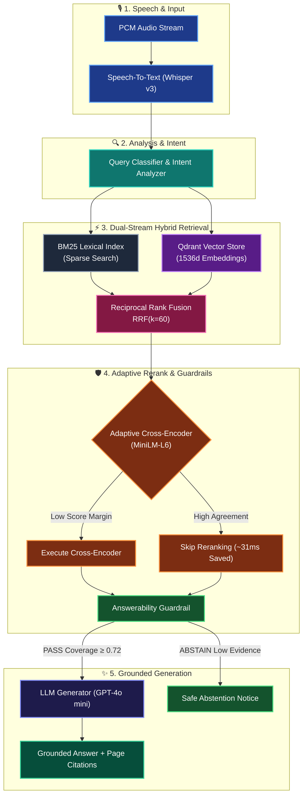

# VoiceRAG ◈

> **Production-Oriented, Voice-Enabled Retrieval-Augmented Generation System**
> *From Streaming Voice → Dual-Stream Hybrid Retrieval → Adaptive Reranking → Guardrail Verification → Grounded Answer with Citations.*

---

## 🏛️ System Architecture

<details open>
<summary><b>🔍 Click to expand/collapse System Architecture Diagram</b></summary>

<br/>



</details>

---

## ✨ Key Features

- **🎙️ Real-Time Voice STT**: Speech-to-Text with automatic local fallback (`Whisper.cpp`).
- **📚 Multi-Format Chunking**: Fixed, Structural (Markdown H1-H6), Parent-Child, and Adaptive Semantic chunking.
- **⚡ Dual-Stream Hybrid Retrieval**: Concurrent BM25 (Lexical) + Dense HNSW (Qdrant) fused via **Reciprocal Rank Fusion ($k=60$)**.
- **🧠 Adaptive Cross-Encoder Reranking**: Dynamic reranking evaluation that skips redundant processing when initial dense/sparse agreement is high, saving ~31ms per query.
- **🛡️ Provable Grounding & Abstention Guardrails**: Verifies candidate evidence coverage and contradiction scores to abstain when evidence is insufficient.
- **📊 Research & Benchmark Console**: Full Next.js 14 developer console with real-time execution DAGs, stage latency waterfalls, and P50/P75/P95/P99 metrics.

---

## 🛠️ Technology Stack

| Layer | Technologies |
| :--- | :--- |
| **Backend Core** | Python 3.11, FastAPI, Pydantic v2, Uvicorn, OpenTelemetry |
| **Vector & Search** | Qdrant Vector Database, Rank-BM25, OpenAI Embeddings (`text-embedding-3-small`) |
| **Speech & LLM** | OpenAI Whisper v3 / Whisper.cpp, Cross-Encoder (`ms-marco-MiniLM-L-6-v2`), GPT-4o mini |
| **Frontend UI** | Next.js 14 (App Router), React 18, Tailwind CSS v4, Framer Motion, Lucide React |
| **Containerization** | Docker, Docker Compose |

---

## 🚀 Quick Start

### Option 1: Docker Compose (Recommended)

Start the full stack (FastAPI Backend + Qdrant Vector DB + Next.js Frontend):

```bash
# 1. Clone & prepare environment configuration
cp docker/.env .env

# 2. Build and start containers
docker compose -f docker/docker-compose.yml up --build -d
```

- **Frontend Console**: `http://localhost:3000`
- **Backend API**: `http://localhost:8000/docs`
- **Qdrant Dashboard**: `http://localhost:6333/dashboard`

---

### Option 2: Local Development

#### 1. Backend Setup

```bash
# Install Python editable package with dev tools
pip install -e ".[dev]"

# Start Qdrant Vector DB via Docker
docker run -d -p 6333:6333 -p 6334:6334 qdrant/qdrant:latest

# Start FastAPI server
uvicorn app.main:app --reload --port 8000
```

#### 2. Frontend Setup

```bash
cd frontend
npm install
npm run dev
```

---

## 📑 Developer Console & Pages

The frontend application exposes 10 dedicated research and management pages:

- **`/` Workspace Landing**: Create research workspaces and inspect system pillars.
- **`/documents` Documents Overview**: File drop zone, Knowledge Base status, and chunk breakdown.
- **`/ask` Voice Q&A Console**: Real-time microphone recorder, live pipeline execution DAG, retrieval comparator, reranker & guardrail cards, and citation viewer.
- **`/runs` Runs Trace**: Complete query execution logs and latency waterfall inspectors.
- **`/runs/[runId]` Run Detail**: Stage-by-stage latency waterfall chart across all 8 pipeline phases.
- **`/benchmarks` VoiceRAG-Bench**: P50/P70/P95/P99 latency distribution, Recall@10, MRR, nDCG, and Groundedness metrics.
- **`/experiments` Experiment Matrix**: Side-by-side ablation comparison across chunking, retrieval, reranking, STT, and prompt variants.
- **`/architecture` Interactive Architecture**: Clickable system node graph displaying models, fallbacks, and failure behaviors.
- **`/settings` System Settings**: Configurable thresholds for STT, top-k retrieval, RRF $k$, reranker modes, and LLM temperature.

---

## 🧪 Testing & Verification

```bash
# Run unit test suite
pytest tests/unit/ -v

# Run integration tests
pytest tests/integration/ -v

# Code Quality & Type Checks
ruff check app/ tests/
mypy app/
```

---

## 📜 License

Distributed under the [MIT License](LICENSE).
